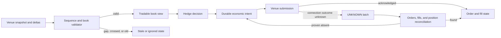

# Trading execution safety

A hedging service that consumes sequenced perpetual-futures book updates must stop trading when the local book is untrustworthy, and it must not retry a venue order whose acknowledgement was lost.

Portfolio project using fictional data. It is not connected to an employer, client, or production system.



The decision record is [ADR 0001](docs/0001-explicit-invalid-and-unknown-states.md).

## Capabilities

- Build a two-sided book from a validated snapshot and apply strictly sequenced deltas.
- Ignore old or duplicate messages without mutating state; latch `STALE` on a gap, invalid level, or crossed market.
- Refuse a tradable view when the last valid update is too old or its receive timestamp is ahead of the clock.
- Persist one client order per economic intent before any venue write.
- Treat a timed-out submission as `UNKNOWN`, not failed, and require attempt-bound evidence that the order, fills, and position effect are absent before retry.

## Run

```bash
npm ci
npm run verify
```

`verify` runs strict TypeScript, seventeen tests, and a structured walkthrough of a book gap plus an uncertain submission. Node.js 22 is the CI runtime.

## Verification

GitHub Actions on push and pull request runs `npm ci`, `npm run verify`, and confirms `MANIFEST.sha256` against `scripts/build-evidence-manifest.sh`.

Prices and quantities are exact integers (`bigint`). Discriminated unions make `STALE` and `UNKNOWN` ordinary states rather than missing-field accidents.

## Design

- Recovering from `STALE` requires a fresh snapshot. Deltas cannot patch a gapped book.
- Repeating the same canonically encoded intent is idempotent. Delimiter collisions and changed payloads are rejected.
- Fills may arrive before the acknowledgement. Exact execution replay is ignored even after `FILLED`; a changed quantity or price is rejected, including overfills.
- The first acknowledged venue order ID is immutable.

`src/marketDataBook.ts` owns sequence and freshness. `src/orderJournal.ts` owns intent, unknown outcomes, fills, and the audit trail.

## Limitations

In-memory journal, no live venue, no matching engine. See [LIMITATIONS.md](LIMITATIONS.md).
