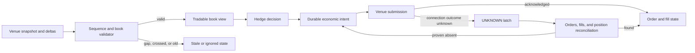

# Trading execution safety core

**Status:** implemented synthetic TypeScript demonstration.

A small executable trading-systems exercise that proves two safety properties: a locally maintained order book stops being tradable when sequence integrity is lost, and an uncertain venue submission cannot be retried blindly.

## Scenario

A hedging service consumes sequenced perpetual-futures order-book messages and submits child orders to a venue. Messages may be duplicated or skipped. A connection can close after an order has been written but before the acknowledgement arrives. Private fills can arrive before the order acknowledgement and may be replayed.

## Demonstrated outcome

- Build a two-sided book from a validated snapshot.
- Apply strictly sequenced deltas and ignore old messages without mutating state.
- Latch the book stale on gaps, invalid levels, or a crossed market.
- Block trading when the last valid update exceeds a declared age limit.
- Persist one client order per economic intent before submission.
- Represent a timed-out submission as `UNKNOWN`, not failed.
- Block blind retry and require recorded reconciliation evidence.
- Accept fills before acknowledgements, deduplicate execution replay, and reject overfills.
- Preserve an ordered audit trail of intent and execution-state changes.

## Architecture



The key decision is documented in [ADR 0001](docs/0001-explicit-invalid-and-unknown-states.md).

## Implemented stack

TypeScript, Node.js, Vitest, strict compiler options, exact integer quantities and prices, and deterministic in-memory state. The boundaries are deliberately small enough for an interview walkthrough. A production version would use a durable transactional journal, venue-specific sequence rules, exact decimal scaling by instrument, authenticated operator actions, and fenced ownership for order submission.

## Acceptance scenarios

1. A valid snapshot and next delta publish the expected best bid and ask.
2. A duplicated or regressing delta is ignored without corrupting the book.
3. A sequence gap latches stale and prevents a tradable view.
4. Recovery from stale requires a fresh snapshot.
5. An aged book is not tradable even if its sequence is intact.
6. Crossed snapshots are rejected and crossed deltas latch stale.
7. Repeating the same intent is idempotent; changed payloads and duplicate economic intents are rejected.
8. A timed-out submission cannot be sent again without reconciliation evidence.
9. A fill before acknowledgement is accepted and its replay is ignored.
10. An overfill is rejected without mutating accepted fill state.

## Run it

```bash
npm install
npm run verify
```

`verify` runs strict TypeScript checking, thirteen automated tests, and a structured executable walkthrough.

## Repository shape

```text
src/marketDataBook.ts  snapshot, delta, sequence, crossed-book, and freshness rules
src/orderJournal.ts    durable-intent model, unknown outcome, retry, fill, and audit rules
src/types.ts           discriminated unions and exact-value domain contracts
src/demo.ts            executable gap and uncertain-submission walkthrough
test/                  market-data and order-state acceptance tests
docs/                  architecture decision record
```

## Interview use

- Explain why an order timeout is not evidence of failure.
- Show how discriminated unions make invalid and uncertain states unavoidable.
- Discuss where persistence, fencing, venue-specific protocol rules, and observability belong in production.
- Extend the exercise with cancellation, parent/child routing, position reconciliation, or a deterministic simulated venue if requested.

## Non-goals

No real exchange, market data, strategy, custody, account, key, or client information is used. This is not a matching engine, smart order router, production feed handler, performance benchmark, or investment strategy. It makes no claim about any employer's or venue's private architecture or technology stack.
